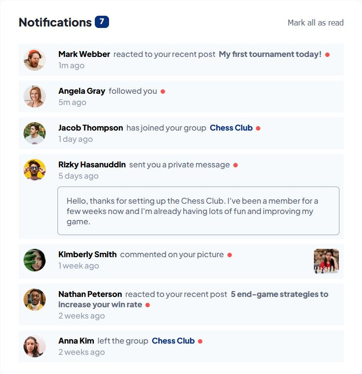

# Frontend Mentor - Notifications-page

This is my [Firas Turak](https://www.linkedin.com/in/firasturak/) solution to the [notifications page challenge on Frontend Mentor](https://www.frontendmentor.io/challenges/notifications-page-DqK5QAmKbC).

## Table of contents

- [Overview](#overview)
  - [The challenge](#the-challenge)
  - [Screenshot](#screenshot)
  - [Links](#links)
- [My process](#my-process)
  - [Built with](#built-with)
  - [What I learned](#what-i-learned)
- [Author](#author)


## Overview

### The challenge

Users should be able to:

- Distinguish between "unread" and "read" notifications
- Select "Mark all as read" to toggle the visual state of the unread notifications and set the number of unread messages to zero
- View the optimal layout for the interface depending on their device's screen size
- See hover and focus states for all interactive elements on the page

### Screenshot



### Links

- Solution URL: Link to solution is in github-pages under Environments of the repo.

## My process

#### Built with

- Semantic HTML5 markup
- CSS custom properties
- JavaScript
- Flexbox
- Mobile-first workflow

### What I learned

Came up with using attributes with HTML elements for state management. In this case unread/read states of notifications.

```js
if(notification.getAttribute("read", true)) return; //If is already read don't mark

notification.setAttribute("read", true); //Assign that we cant read this notification again
```

## Author

- Website - [Firas Turak](https://www.linkedin.com/in/firasturak/)
